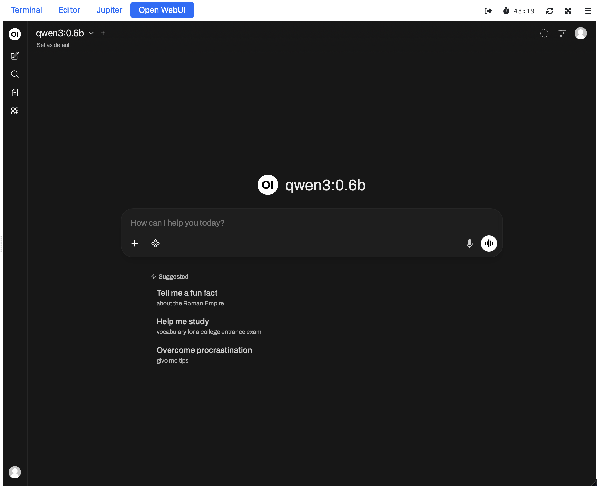

The lab also consist of an backend Ollama instance, for running LLM models, and a Open-WebUI as frontend.
This frontend also allows you to download other models, that can be used for some of the other services.
