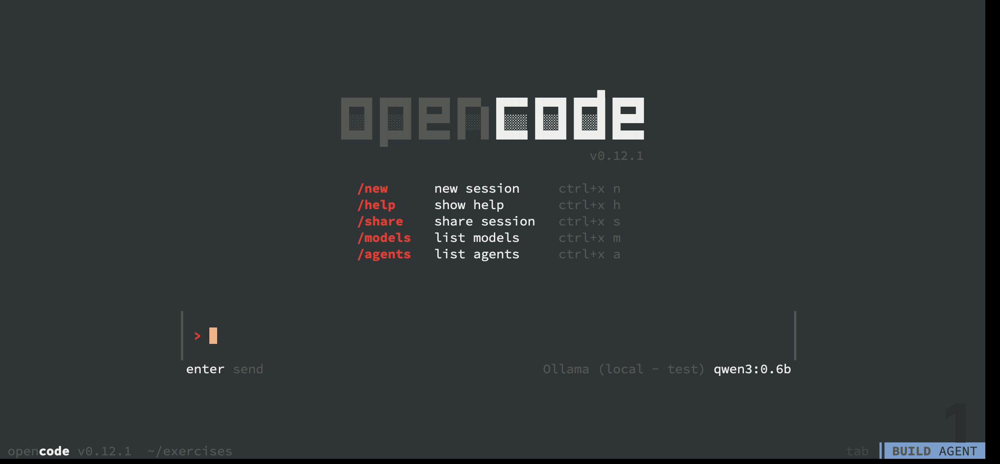

This lab also supports Opencode.

We have configured it to use the Ollama instance already in the lab, and to use the qwen3:0.6b model.

Fist you need to download the model to Ollama, if you have not done so already.

```terminal:execute
prefix: Pull Model
title: qwen3:0.6b
session: 2
command: |
  curl -X POST url http://ollama.$SESSION_NAMESPACE:11434/api/pull \
  -H "Content-Type: application/json" \
  -d '{"name": "qwen3:0.6b"}'
```

Start the Terminal UI by running
```terminal:execute
prefix: Run
title: OpenCode
command: |
  opencode
```



From here you can use the OpenCode tool, to generate code, or talk with the LLM about the content in your excersises directory. 